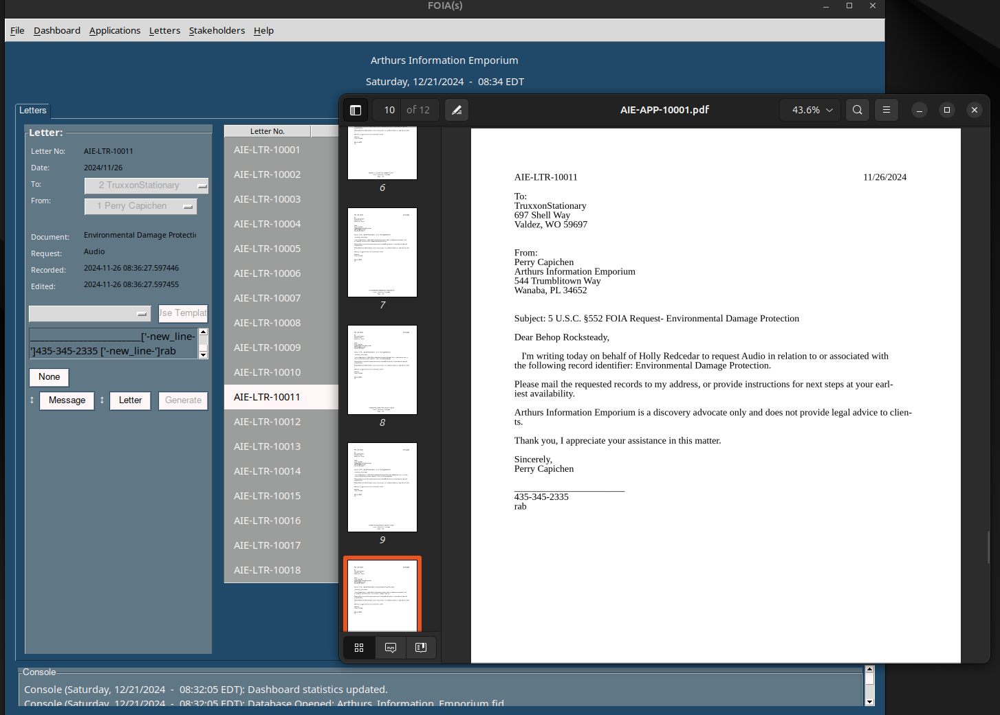
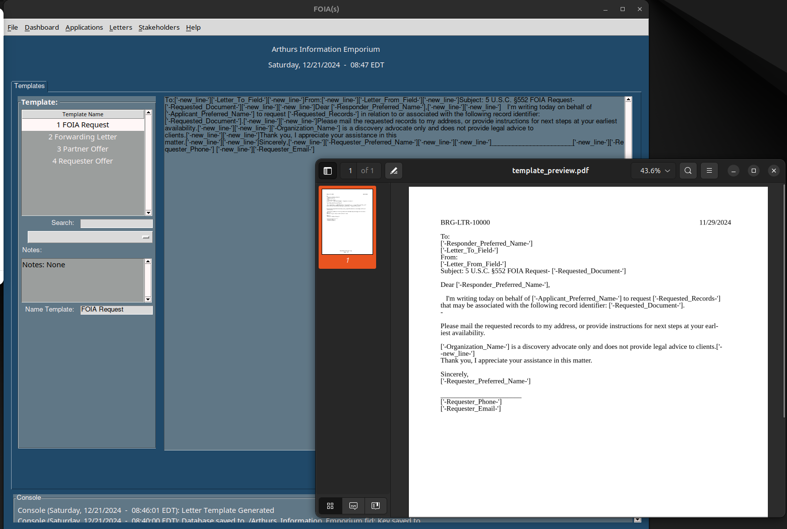
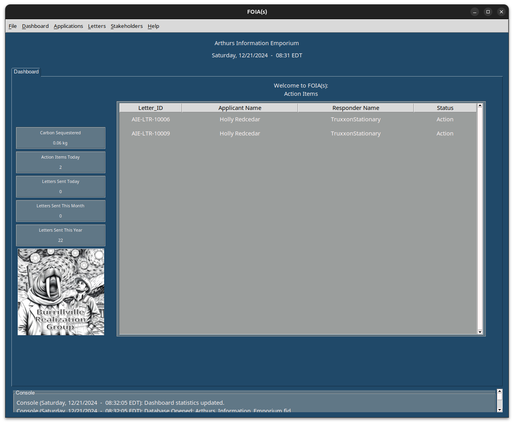

# Welcome to FOIA(s)!

Welcome to FOIA(s)! This software will generate form letters (an advanced “mail merge”) allowing you to request sets of information using paper letters with tracking numbers. It is intended for professionals and advocates in the United States to use to request information from government offices under 5 U.S.C. §552, known as the “Freedom of Information Act” (FOIA). The complete text of FOIA and all official comments, analysis, and discussion form a part of this manual for all interactions you have with government offices while using this software in the United States. When tactfully used, form letters can be a powerful tool for shining a light on injustice or an unaddressed need in society. 

## Version: 1.02 (Blackbird)

Developed in the United States by Joseph M. Basile. 

Special thanks Kevin D. Hall et al.

Complaints Appreciated. Paypal: josephmbasile@gmail.com

MIT License 2024

## System Recommendations
A multi-core desktop or laptop computer running Linux, MacOS, or Windows, with two monitors at 1080P resolution. A laser print/scan/fax center is recommended for management of paper letters. RAM: 16GB or greater. A pdf reader is necesarry for viewing letters. 

## Installation
Download the entire respository from GitHub. Unzip the repository to your desired storage location. 

## Compiling the Software (Linux)

Compiling this program from code requires Python 3. Please follow the installation instructions here: https://www.python.org/downloads/

Once you have Python 3 installed, open a terminal and navigate to the FOIA(s) folder. Enter the following commands to create a virtual environment and install requirements:

1. Create a virtual environment in the folder in a hidden subfolder called ".venv".
   
    > python3 -m venv .venv

2. Activate the virtual environment in the terminal:
   
    > source .venv/bin/activate

3. Install all prerequisites in the virtual environment you created:
    > pip install -r requirements.txt

4. Compile your executable, which will be configured for your operating system.
    > pyinstaller --onefile ./FOIAs.py   
    
5. Copy the executable into the FOIA(s) folder:
    > cp dist/FOIAs ./FOIAs.exe

6. Consider sharing your executable on a GitHub branch with operating system information. Thank you.

## Opening the Software

There are several ways to start FOIA(s). Find your operating system and follow the instructions below.

### Linux

#### Running from code (recommended):
Running this program from code requires Python 3. Please follow the installation instructions here: https://www.python.org/downloads/

Once you have Python 3 installed, open a terminal and navigate to the FOIA(s) folder. Enter the following commands to create a virtual environment and run from code:

1. Create a virtual environment in the folder in a hidden subfolder called ".venv".
   
    > python3 -m venv .venv

2. Activate the virtual environment in the terminal:
   
    > source .venv/bin/activate

3. Install all prerequisites in the virtual environment you created:
    > pip install -r requirements.txt

4. Launch FOIA(s):
    > python3 FOIAs.py

The Graphical User Interface (GUI) will pop up showing the Dashboard or the PySimpleGUI license menu.

### Windows

Build an executable using pyinstaller or run from code. Please post your solution to a GitHub branch.

### MacOS

Build an executable using pyinstaller or run from code. Please post your solution to a GitHub branch.

## PySimpleGUI Keys

This software's graphics are powered by a plugin called PySimpleGUI and it may require you to obtain a license key to unlock the plugin on your first startup. Non-commercial users can select a hobby license which was free as of January 2025.

https://www.pysimplegui.com/faq

## Creating a Database

1. Click File>New Database to bring up the New Database dialog. 

2. Enter information for your organization. 
   
3. Your database will be saved in the FOIAs folder with the file extension .fid and your organization name as the filename.
   
4. The filekey save location can be on your computer or on a usb drive and will appear as a .fidkey file with a filename that matches the database file. 
   
   4.1. Keeping a secure backup of your key is reccomended and can be accomplished by copying the file or by printing the text code found in the fidkey file and storing the paper in a secure location. 
   
   4.2. To recreate a key, type the entire code into a text editor and save it with the same name as your database file and the extension .fidkey. 

   4.3. Keeping your key file on a usb drive creates a physical key for your database and prevents unauthorized access when you're away. 
   
5. Choose a Documents Folder location. Applications, Letters, and Previews will appear here.
   
6. Choose a photo or logo. It can be a photo of yourself.
   
7. Enter any notes you wish to store.
   
8. Click "Submit"

## Managing Database Properties

1. With a database loaded, Click File>Database Properties.
   
2. Make changes to the fields and then click Save Changes.

## Opening a Database

1. Click File>Open Database to bring up the open dialog.
   
2. Click the Browse button and navigate to the filekey for your database.
   
3. Click the Open button.

## Saving a Database

1. Click File>Save Database.
   
The database will also autosave every ten minutes.

## Managing Requesters

1. Click Stakeholders>Requesters.
   
2. The database owner will appear with Requester_ID of 1. Click on the Requester to view details.
   
3. Click Edit Requester to change details.
   
4. Click New Requester to add a requester.
   
5. Search in the search box near the New Requester button.
   
6. The cancel button will clear the form. Sometimes it needs an extra click.

## Managing Applicants

1. Click Stakeholders>Applicants.
   
2. Click New Applicant to add an applicant.
   
3. Click Edit Applicant to change details.
   
4. Search in the search box near the New Applicant button.
   
5. The cancel button will clear the form. Sometimes it needs an extra click.

## Managing Responders

1. Click Stakeholders>Responders.
   
2. Click New Responder to add an responder.
   
3. Click Edit Responder to change details.
   
4. Search in the search box near the New Responder button.
   
5. The cancel button will clear the form. Sometimes it needs an extra click.

## Managing Templates

Templates are managed in a dedicated interface accessible from the menu by clicking Letters>Templates. 

1. Select a template from the templates list. It will automatically open for editing.
   
2. Edit the template using the Parcel Script Tag Editor (See Below). Any tag you select will be copied to your clipboard (ctrl+v to paste). Save your template by clicking Save Changes.
   
3. Select New Template to start a new template. A basic template outline will appear. Don't forget to name your template. 
   
4. Preview your template with the Preview button. The pdf will appear and you will see the fields roughly arranged into a letter format.
    
5. On some systems you can keep the preview pdf open while you make changes. Simply hit preview again to update the view.
   
6. Click Save New to save your template.

### FOIA Markup Language (Parcel Script)

The program will load and populate a template each time it generates a letter. There are tags in the template which correspond to different pieces of information in the database, such as the Applicant's Preferred Name or the Responder's Mailing Address. When you select a tag from the tag list in the editor, it is automatically copied to your clipboard. You can then paste it into the Template Editor and hit Preview to see what it looks like. When you use the template to generate letters, the software will replace the tags with the corresponding piece of information and then generate a .pdf file.

Always use the new_line tag when starting a new line.

#### General Tags:

    > ['-new_line-']
    > ['-Requested_Document-']
    > ['-Requested_Records-']

#### Applicant Tags:
    > ['-Applicant_Preferred_Name-']
    > ['-Applicant_First_Name-']
    > ['-Applicant_Middle_Name-']
    > ['-Applicant_Last_Name-']
    > ['-Applicant_Title-']
    > ['-Applicant_Full_Name-']
    > ['-Applicant_Phone_Number-']
    > ['-Applicant_Phone_Number_Type-']
    > ['-Applicant_Fax_Number-']
    > ['-Applicant_Return_Address-']
    > ['-Applicant_Notes-']
    > ['-Applicant_Email-']
    > ['-Application_Number-']

#### Requester Tags:
    > ['-Letter_From_Field-']
    > ['-Requester_Email-']
    > ['-Requester_Phone-']
    > ['-Requester_Phone_Number_Type-']
    > ['-Requester_Preferred_Name-']
    > ['-Requester_First_Name-']
    > ['-Requester_Middle_Name-']
    > ['-Requester_Last_Name-']
    > ['-Requester_Full_Name-']
    > ['-Requester_Return_Address-']
    > ['-Requester_Fax_Number-']
    > ['-Requester_Notes-']
    > ['-Organization_Name-']

#### Responder Tags:
    > ['-Letter_To_Field-']
    > ['-Responder_Preferred_Name-']
    > ['-Responder_Organization_Name-']
    > ['-Responder_Organization_Type-']
    > ['-Responder_Contact_First_Name-']
    > ['-Responder_Contact_Last_Name-']
    > ['-Responder_Contact_Email-']
    > ['-Responder_Phone_Number-']
    > ['-Responder_Phone_Number_Type-']
    > ['-Responder_Fax_Number-']
    > ['-Responder_Organization_Address-']
    > ['-Responder_Organization_Mailing_Address-']
    > ['-Responder_Organization_Email-']
    > ['-Responder_Organization_Website-']
    > ['-Responder_Notes-']

## Managing Letters

1. Click Letters>View Letters.
   
2. Click New Letter to create a new single letter.
   
   2.1. Select a Responder for the To field.

   2.2. Select a Requester for the From field.

   2.3. Enter a Document and a Request.

   2.4. Select a template from the Template dropdown.

   2.5. Hit Generate to generate the pdf. The pdf should appear on your screen.

   2.6. To attach a scan of the letter, make sure the Letter selector is set to Letter and then click the file browse button above it.

   2.7. Warning! Single letters do not save in the database until a scan has been attached.

   2.8. Warning! Applicants are not assigned to single letters and the applicant Parcel Script fields will not work.

3. Select a letter from the table to view its details. 
   
   3.1. A status of "Open" means the letter has been generated or sent but a response has not yet been received.

   3.2. A status of "Action" means the letter has been sent and a response has been received and logged in the database.

   3.3. A status of "Closed" means the letter and response have been forwarded to the Applicant.
   
4. Click the Letter Selector button at the botton to record a response or forwarding letter.
   
5. Click the Message Selector button to change to Forwarding mode and generate a Forwarding Letter from a template. 
   
6. Search in the search box near the New Responder button.
   
7. The cancel button will clear the form. Sometimes it needs an extra click.

## Managing Applications

1. Click Applications>View Applications.
   
2. Click New Applicaiton to create a new Application.
   
   2.1. Select a Requester.

   2.2. Select a Responder. 

   2.3. Select an Applicant.

   2.4. Enter your Documents and your Requests. Remember all Requests apply to all Documents, so you should use multiple applications for sets of Documents with different requests.

   2.5. Select a template from the Template dropdown.

   2.6. Hit Generate to generate the pdf. The pdf should appear on your screen.

   2.7. To attach a scan of the application form, click the Attach Record button at the bottom.

   2.8. Hit Save New to save the Application.

   2.9. Individual letters generated by an application are saved in the database without an attached scan. It is recommended that you print, sign, scan, and attach each letter to its corresponding entry in the database.

3. Select an application from the table to view its details. 
   
4. To attach a scan of the application form, click the Attach Record button at the bottom.

5. To view a scan of the application form, click the View button.
      
6. Search in the search box near the New Responder button.
   
7. The cancel button will clear the form. Sometimes it needs an extra click.

## Dashboard Statistics

The dashboard displays your usage statistics as well as a list of letters which have a status of 'Action' meaning they have a response logged but no forwarding letter. 

On the left, the usage statistics show the Carbon Sequestered by your letters in kilograms. The program assumes each sheet of paper sequesters 2.5 grams of carbon.

The left panel also shows the number of action items that are pending as well as the number of letters sent in the current day, month, and year. Your logo should appear below these statistics.

## Recommended Backups

It is strongly reccomended that you back up your FOIA(s) folder and your documents respository regularly.

## Release Log

Version 1.01 (Cajones)
1. Initial Commit
   
Version 1.02 (Blackbird) 
1. Minor Bug Fixes.
2. Disabled the Generate Button on the Letters page.
3. The Generate Application button now disables after the first click.
